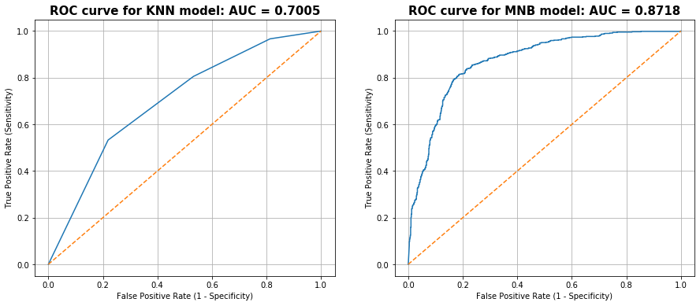

# Project 3: Web Scraping and NLP. Depression vs Bipolar

## Table of Contents

[Directory Structure](#Directory-Structure)<br>
[Project Outline / Problem Statement](#Project-Outline-/-Problem-Statement)<br>
[Description of Data](#Description-of-Data)<br>
-[Size](#Size)<br>
-[Source](#Source)<br>
[Data Visualization](#Data-Visualization)<br>
[Conclusion](#Conclusion)<br>
-[Next Steps](#Next-Steps)<br>


## Directory Structure

```
.
├── project_3
    ├── code
        ├── 01_gathering_data.ipynb
        ├── 02_eda_cleaning.ipynb
        ├── 03_pre_processing.ipynb
        ├── 04a_modeling_nb.ipynb
        ├── 04b_modeling_logreg.ipynb
        ├── 04c_modeling_knn.ipynb
        ├── 05_evaluation.ipynd
    ├── data
            ├── bipolar_df.csv
            ├── data_cleaned.csv
            ├── data_pre_processed.csv
            ├── depression_df.csv
    ├── real_time_predictions
        ├── cvec.pickle
        ├── mnb.pickle
        ├── real_time_predictions.py
        ├── training_model.py
        ├── real_time_preds_curses.py
    ├── plots
        ├── roc_curve.png   
    ├── README.md
    └── depression_vs_bipolar.pdf
```

## Project Outline / Problem Statement

Every day psychiatrist struggle making a diagnosis. Without any actual medical tests, such as brain scans, at their disposal, they are left trying to make a diagnosis based on the patient's behaviour. Bipolar disorder ofter gets misdiagnosed as depression or anxiety. This is detrimental to the patient who actually does have depression, since incorrect medication can actually exasperate the condition. The same stands for depression as well.

Provided with numerous posts on Reddit, I made it a task to see if I could build a model that can tell a difference between a bipolar and depression diagnosis. After scraping two subreddits, I compared Naive Bayes, Logistic Regression, and KNN models to finetune one that would perform the best. My main concern was measuring the accuracy of the model. After, choosing my model, I went ahead and train my model to make real time predictions. In the 'real_time_predictions' subfolder you will find a code that if ran will tell you with some accuracy whether the person who wrote a paragraph about how they feel should be treated for bipolar or depression (real_time_predictions.py). To take it another step further, I implemented a code that calculated the probability of depression or bipolar as you type in your input in real time. This can be found in file real_time_preds_curses.py.


---
## Description of Data

The Reddit depression and bipolar subreddits were scrabed with reddit api.pushshift.io.


### Size

I gathered 2000 unique posts each for depression and bipolar.


### Source

The depression data was gathered from [this subreddit](https://www.reddit.com/r/depression/).

The bipolar data was gathered from [this subreddit](https://www.reddit.com/r/bipolar/).

---
## Data Visualization



---

---

<p align="center"></p>


---
## Conclusion

The model is able to predict with approximately 80% accuracy score whether someone suffers from depression or bipolar disorder. The model used for the final real time predictions is Multinomial Naive Bayes with CountVectorization.

The logistic regression model was abandoned from the start since it gave incredible overfit results. Conclusion that was reached based on the train/test split accuracy scores. The final two models compared were Multinomial Naive Bayes and KNN. Multinomial Naive Bayes won hands down.


### Next Steps

To expand on the success, it would be beneficial to extand the model to anxiety, PTSD, ADHD and other mental conditions.

---
